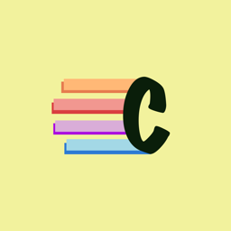

# ColorQueue

This is a simple distributed game where two players play againt each other to win.

## Rules:
* You have a stack of color that you need to send to your opponet, to do so you need to click int the bottom pannel the corresponding color that is in the bottom of the stack as quickly as possible.
* Onece you have click it that color is removed from your stack and all colors move one possition down as if they where affected by the gravity. Also that color is sent to the top of the stack of your opponent.
* You cannot be without colors in your stack so if that is going to happen one random color is automatically generated.
* To make the game a bit faster and challenging there is a small chance that one new color is randomly generated in your stack, also if you click another color that is not the one at the bottom of the stack that will happen as well.
* **To win** you need to fill your opponent's stack so click the colors as fast as you can, at least faster than you opponent.

Project done by Juan Casado Ballesteros

[Mr.BlissfulGrin](http://www.mrblissfulgrin.com "mrblissfulgrin")

[Cocos2d-x c++ game engine](http://www.cocos2d-x.org "Cocos2d-x c++ game engine")

